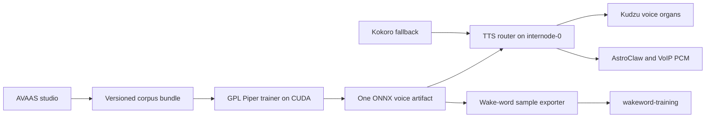

# Satraj/Piranesi Production Voice Pipeline Design

- Status: Approved for implementation
- Date: 2026-07-16
- Author: CPCS
- Primary repository: AVAAS
- Related repositories: `wakeword-training`, `piranesi-org/workspace`

## 1. Decision summary

AVAAS will build one standalone, single-speaker Piper medium voice from a corpus
spoken by Satraj. Identity-bearing prompts will have paired Satraj and Piranesi
versions, but both versions train the same acoustic model. The final model will
be exported as a versioned ONNX bundle and exposed under the aliases `satraj`
and `piranesi`; both aliases resolve to the same model and synthesis settings.

Piper is the production target because it has a maintained, documented
single-speaker trainer, resumable checkpoint fine-tuning, ONNX export, CUDA
inference, and chunked synthesis. It is already used by the household Wyoming
and wake-word stack. The model can therefore run on internode-0 without forcing
the physical voice organs or telephony adapters to understand a new model
format.

Kokoro remains the operational fallback. It has no supported custom-speaker
training path, so AVAAS will not claim that an interpolated Kokoro style vector
is a trained Satraj/Piranesi voice. Chatterbox remains an optional zero-shot
preview only; its public repository does not provide the production training
and export path that AVAAS currently pretends to launch. XTTS is the measured
contingency if Piper fails the voice-similarity promotion gate, not a second
model trained by default.

The artifact and serving contracts are engine-neutral so a future trainer can
replace Piper without changing the studio, voice organs, wake-word importer, or
telephony clients.



## 2. Verified baseline

### 2.1 AVAAS source and deployment

The canonical AVAAS Git source is currently
`KuriGohan-Kamehameha/AVAAS` on GitHub, branch `main`. A transfer to the
P1R4N351 account was initiated previously but is not complete. No AVAAS
repository currently exists on the household Gitea instance.

The hosted studio at `https://piranesi-branch-0.tail8d99b6.ts.net/` is built
from an unversioned private/live lineage rather than reproducibly from the
GitHub repository. Its persistent data is bind-mounted from
`/srv/avaas-data`. The live corpus is empty at this design baseline, so prompt
ID migration does not risk relabeling accepted recordings. Existing backup
copies on trueblue ZFS and piranesi-main must still be verified before the
migration.

The live parser exposes 324 prompts, not the advertised 824. Harvard section 1
and CMU ARCTIC section 2 are missing because their external text files were not
included in the image. The readiness calculation excludes zero-prompt
sections, so it can falsely declare an incomplete corpus ready.

The current `training` path is not a trainer. Its Chatterbox builder raises
`NotImplementedError`, while its shell wrapper searches upstream for guessed
entry points. A production build must remove that false-success surface.

### 2.2 Live voice organs

Piranesi currently speaks through these internode-0 services:

- `kudzu-tts.service` on port 5006: Kokoro-ONNX on a GTX 1660 SUPER.
- `kudzu-vox.service` on port 9668: the physical mic/speaker organ.
- `kudzu-stt.service` on port 5007 and Wyoming port 10300.
- `kudzu-spk.service` on port 5008: sherpa-onnx speaker embeddings.

The current organ-facing synthesis contract is:

```text
GET or POST /tts
  text=<up to 800 characters>
  voice=<voice id>
  speed=<float>
  lang=<language>

200 audio/wav
  mono PCM16
  24,000 Hz
  Content-Length present
  HTTP/1.1 persistence
```

`voxd` buffers that WAV and plays it through ALSA. It depends on the contract,
not on Kokoro internals. Its configured voice is currently `am_michael`.

The canonical source for the organs is the private Gitea repository
`piranesi-org/workspace`, branch `main`, under `infra/kudzu-vox/`. Changes must
land there and deploy through its differentiation/install flow. Direct edits
under `/opt/tts` or `/opt/kudzu-vox` are not canonical. The active
`/opt/tts/server.py` has already drifted from Gitea and must be reconciled as
part of this work.

### 2.3 GPU and runtime constraints

Internode-0 has six NVIDIA GPUs, including a 24 GB RTX 3090 and several 6-10 GB
cards. It has only 8 GB of host RAM and is already using swap. Inference on a
small Piper ONNX model is suitable for this host. Training may use the 3090
only after a host-RAM, disk, thermal, and lane-occupancy preflight succeeds; it
must otherwise run on another CUDA worker and deliver the same signed artifact
bundle to internode-0.

The model is trained at Piper's native 22,050 Hz. The serving boundary
deterministically resamples to 24,000 Hz so existing organs and AstroClaw's
local telephony provider keep their current audio assumptions.

### 2.4 Phone and VoIP reality

No Asterisk/voip.ms stack is deployed today. The newer local AstroClaw source
does contain a Twilio streaming path that accepts raw mono PCM16 at 24 kHz,
resamples it to 8 kHz, encodes G.711 mu-law, and emits paced 20 ms frames with
barge-in. The live AstroClaw gateway is older and the voice-call plugin is
disabled.

This project must therefore make the model immediately consumable by both the
current organs and the existing AstroClaw provider contract. Deploying a SIP
PBX or enabling a paid carrier is outside this design. A synthetic telephony
contract test is in scope; a real carrier call becomes a separate activation
step once credentials and routing exist.

## 3. Goals

1. Address the user as Satraj in every visible prompt and studio surface.
2. Record natural Satraj and Piranesi self-introductions, names, spellings,
   voicemail lines, and phone dialogue in one speaker corpus.
3. Preserve all irreplaceable masters and make retakes non-destructive.
4. Fail closed when required prompt sections, QC, licenses, trainer
   capabilities, artifacts, or target-host benchmarks are missing.
5. Produce one standalone, versioned Piper ONNX voice bundle.
6. Serve that voice on internode-0's GPU through the legacy organ contract and
   an OpenAI-compatible speech contract.
7. Produce bounded streaming PCM suitable for a voice waist or telephony
   adapter.
8. Export synthetic `Hey Piranesi` material to `wakeword-training` through a
   versioned, validated manifest.
9. Make source, dependencies, training inputs, artifacts, deployment, and
   rollback reproducible from their canonical repositories.
10. Satisfy P10, security, test, and operational promotion gates with recorded
    evidence.

## 4. Non-goals

- Piranesi is not modeled as a second human speaker. `satraj` and `piranesi`
  are aliases for one acoustic model.
- AVAAS will not train the openWakeWord detector itself.
- This change will not deploy Asterisk, purchase or configure a carrier, or
  enable outbound calling.
- The pipeline will not represent a reference clip or zero-shot embedding as a
  completed trained model.
- The final personal model cannot exist before Satraj records an accepted
  corpus. Implementation can validate the whole pipeline with bounded fixtures,
  but fixture artifacts are marked non-promotable.
- The public repository will not contain personal recordings, private model
  weights, service credentials, or speaker-identity embeddings.

## 5. Identity and prompt model

### 5.1 Canonical identities

The prompt compiler consumes a versioned identity configuration with these
logical entries:

```json
{
  "schema": "avaas/identities@v1",
  "speaker_id": "satraj",
  "voice_model_id": "satraj-piranesi",
  "identities": [
    {"id": "satraj", "display_name": "Satraj", "role": "creator"},
    {"id": "piranesi", "display_name": "Piranesi", "role": "bequeathed"}
  ]
}
```

The configuration also carries a pronunciation lexicon. The final phoneme
forms are derived and checked against the recorded name material rather than
silently guessed. Piper/espeak pronunciation regression tests cover both
names before a model can be promoted.

`Sat` may remain an operating-system username or internal historical value,
but it must not appear in user-facing copy or new training text.

### 5.2 Prompt variants

The canonical prompt source becomes versioned structured data. Markdown is a
generated human-readable view, not the parser's database.

Every prompt has a stable base ID independent of its text. Identity-bearing
prompts declare a variant set. Compilation creates IDs such as:

```text
sec03_001__satraj
sec03_001__piranesi
```

Each compiled record contains:

```json
{
  "id": "sec03_001__piranesi",
  "variant_of": "sec03_001",
  "identity": "piranesi",
  "speaker_id": "satraj",
  "voice_model_id": "satraj-piranesi",
  "text": "Hello, this is Piranesi."
}
```

All existing identity-bearing lines are paired. Dedicated additions include:

- natural and formal self-introductions;
- name-only calls at different prosodies;
- spelling Satraj and Piranesi letter by letter;
- voicemail, callback, hold, handoff, and mistaken-identity lines;
- first-person Piranesi lines suitable for an inherited identity;
- `Hey Piranesi`, `Piranesi`, and surrounding conversational contexts;
- phone-band and noisy-room regression text, recorded cleanly at source.

The pair shares `variant_of`, and grouped splitting keeps related variants in
the same train/validation partition. This prevents near-duplicate leakage into
evaluation.

### 5.3 Complete corpora

The repository includes deterministic, licensed copies or build assets for:

- 100 Harvard sentences;
- the selected first 400 CMU ARCTIC sentences;
- AVAAS phone, number, name, spelling, alphabet, spontaneous, and
  conversational material.

Each source has a provenance record, license text or link, exact expected line
count, and SHA-256. The prompt compiler fails if a required source is missing,
has the wrong count, contains duplicate IDs, or changes without a declared
corpus version. Readiness never excludes a mandatory empty section.

## 6. Recording and corpus storage

### 6.1 Durable model

SQLite is the transactional source of truth. It uses WAL mode,
`synchronous=FULL`, foreign keys, explicit schema migrations, and the SQLite
backup API for consistent snapshots. JSONL is a versioned export, not a
concurrent mutation format.

The central entities are:

- `prompts`: compiled immutable prompt/version metadata;
- `takes`: immutable capture attempts and content hashes;
- `derivatives`: DSP outputs and their parameters/hashes;
- `acceptances`: current accepted take per prompt plus audit history;
- `qc_results`: versioned measurements and override reasons;
- `training_jobs`: persisted bounded state machine;
- `artifacts`: model manifests, promotion, and rollback history.

Audio files are content-addressed and never overwritten. A retake is staged,
processed, and QC'd before a transaction changes the accepted pointer. A
failed retake leaves the previous accepted take intact. Deletion is an audited
tombstone; irreversible garbage collection is a separate explicit operation
that is not part of ordinary studio use.

### 6.2 Bounded ingest transaction

Upload handling streams to a staging file while enforcing byte and elapsed
time ceilings. It does not call `read()` on an unbounded body. The decoder then
enforces decoded duration, channel, sample-rate, and finite-sample limits.

The transaction is:

1. validate prompt ID and capture token;
2. stream the bounded upload to staging and hash it;
3. decode to a staged 48 kHz mono PCM16 master;
4. validate duration and signal structure;
5. build deterministic derivatives and QC results;
6. fsync staged files and their directory;
7. atomically move immutable files into content-addressed storage;
8. commit metadata and accepted-pointer changes in SQLite;
9. emit the state event only after the commit.

Navigation cannot relabel a recording: the browser receives a short-lived
capture token bound to the prompt/version at record start, and save uses that
token rather than the page's current prompt.

Room tone is stored as a versioned capture with the same bounds. Recorder and
room-tone chunks use separate state objects. Microphone denial, device loss,
codec rejection, server timeout, and disconnect produce explicit recoverable
UI states.

### 6.3 Derived audio

The irreplaceable master is 48 kHz mono PCM16. Piper training derivatives are
22,050 Hz mono PCM16. Serving output is 24,000 Hz mono PCM16. Wake-word exports
are 16,000 Hz mono PCM16.

DSP parameters and tool versions are included in every derivative record.
Denoising is reversible and conditional: it is selected only when measured
noise improves without worsening intelligibility or introducing clipping.
Raw masters are never denoised in place.

Hard QC includes finite samples, permitted duration, non-silence, channel and
sample-rate conformity, clipping, and output integrity. Soft QC includes LUFS,
SNR, speech proportion, ASR WER/CER, and transcript/name checks. Whisper/model
load failure is an explicit unavailable state and cannot silently count as a
pass. Manual acceptance requires a stored reason and remains visible to the
trainer and model card.

## 7. Readiness and training orchestration

### 7.1 Readiness

Readiness is a pure read operation. `GET /api/progress` has no side effects.
The gate requires:

- every mandatory prompt source present and at the expected version/count;
- configured minimum clean duration;
- configured per-section and per-prompt-kind coverage;
- both identity variants represented in every required identity group;
- no missing/corrupt accepted file or checksum mismatch;
- all hard QC passing and soft overrides audited;
- a frozen train/validation/test split;
- a complete license/provenance ledger;
- a compatible, healthy trainer worker.

Auto-training is off by default. An optional scheduler may enqueue exactly one
job after a readiness transition; it may not launch from a GET request.

### 7.2 Job state machine

Training uses the persisted bounded state machine:

```text
idle -> queued -> validating -> staging -> running -> evaluating
     -> packaging -> succeeded

Any active state -> failed | cancelled
```

Transitions are compare-and-swap transactions with an idempotency key and a
single active-job constraint. Polling and retries have fixed ceilings. A launch
timeout is failure, never `launched`. Failed jobs are not polled forever.

`force` may run a fixture smoke job, but its artifact is permanently marked
`promotable=false`; it cannot bypass production readiness or model evaluation.

### 7.3 GPL service boundary

AVAAS remains MIT. Piper 1.4.2 is GPLv3. AVAAS therefore emits a documented,
checksummed training-job bundle and communicates with an independently
deployed Piper worker through a file/service protocol. AVAAS does not copy,
link, vendor, or import Piper implementation code.

The Piper worker and inference service live in a clearly licensed component in
the canonical private Gitea workspace. Their source distribution includes the
GPL license and source obligations. The selected base checkpoint and every
derived artifact record their separate model/data licenses. A license mismatch
is a hard preflight failure.

### 7.4 Training-job contract

The immutable input directory uses schema `avaas/training-job@v1`:

```text
<job-id>/
  job.json
  metadata.csv
  audio/<content-sha256>.wav
  splits.json
  pronunciation/lexicon.json
  provenance/licenses.json
  checksums.sha256
  READY
```

It contains only accepted 22,050 Hz derivatives, never raw masters or service
credentials. `job.json` declares the exact corpus/artifact schemas, model
profile, bounded hyperparameters, expected toolchain, source commits,
idempotency key, output location, and promotability class. It contains no shell
fragment, arbitrary executable, or path outside the job/output roots.

The producer writes `READY` last after fsync and checksum verification. The
worker rejects an absent `READY`, unknown schema, duplicate ID, invalid split,
path escape, extra executable, license gap, checksum mismatch, or parameter
outside its compiled limits. The worker writes progress to its own persisted
state and publishes an immutable `avaas/training-result@v1` result directory;
it never edits the input job.

### 7.5 Piper training profile

The first production profile is a single-speaker English Piper `medium` voice
at 22,050 Hz, fine-tuned from a pinned compatible checkpoint. The worker pins:

- Piper release and Git commit;
- Python, PyTorch, CUDA, Lightning, espeak-ng, and system packages;
- base checkpoint URL, SHA-256, and license;
- deterministic seed, split hash, batch/accumulation, learning rate,
  checkpoint cadence, and stopping criteria.

The implementation baseline is Piper `v1.4.2` at commit `d6975e2`. Dependency
resolution records a full lock and hashes. Moving to another release requires
the same smoke, license, export, inference, and target-hardware gates; a floating
branch is never a training input.

Training cache and checkpoints are resumable and stored on durable capacity.
The worker never stops unrelated inference services automatically. A resource
preflight checks available host RAM, VRAM, disk, temperature, GPU health, and
lane occupancy. The RTX 3090 is used only if that preflight passes.

The worker exports `<voice>.onnx` and `<voice>.onnx.json`, then runs both CPU
and CUDA inference validation. A checkpoint is not an artifact until export,
manifest construction, and all evaluation gates succeed.

## 8. Voice artifact contract

The immutable bundle root contains:

```text
satraj-piranesi-medium-v1/
  manifest.json
  model/en_US-satraj-piranesi-medium.onnx
  model/en_US-satraj-piranesi-medium.onnx.json
  pronunciation/lexicon.json
  corpus/manifest.json
  evaluation/report.json
  provenance/licenses.json
  provenance/training.json
  checksums.sha256
  model-card.md
  READY
```

`READY` is written last after a clean validation in a new directory. Activation
never mutates a bundle.

The manifest schema is `avaas/voice-model@v1` and includes:

- artifact/model IDs and semantic version;
- `speaker_id=satraj`;
- aliases `satraj` and `piranesi` mapped to one model hash;
- engine, architecture, native rate, canonical serving rate, encoding;
- corpus, split, DSP, base checkpoint, trainer, and source commit hashes;
- licenses and distribution restrictions;
- pronunciation lexicon hash;
- CPU/CUDA validation results;
- evaluation thresholds and measured results;
- creation time, author `CPCS`, and target compatibility declarations.

The bundle is rejected on unknown schema, path traversal, missing file,
unexpected extra executable, duplicate alias, checksum mismatch, incompatible
rate/encoding, absent license, or failed evaluation.

## 9. Model evaluation and promotion

A model must pass all of these before `promotable=true`:

1. Synthesize a held-out fixed set covering both names, numbers, acronyms,
   phone dialogue, punctuation, short utterances, and long bounded text.
2. Meet calibrated ASR intelligibility thresholds after transcript
   normalization.
3. Meet a speaker-similarity threshold against held-out real Satraj recordings
   using a pinned embedding model. Synthetic output is never enrolled as a real
   speaker in `kudzu-spk`.
4. Pass explicit Satraj and Piranesi pronunciation regressions.
5. Produce finite, non-silent, non-clipped audio with sane duration ratios.
6. Pass CPU and CUDA output/shape tests.
7. On internode-0, pass cold/warm p50/p95 latency, real-time factor, RAM/VRAM,
   concurrent organ/phone, client-disconnect, worker-death, and 30-minute soak
   tests.
8. Pass 24 kHz WAV/raw-PCM and 16/8 kHz resampling/telephony golden tests.

Thresholds are versioned before evaluation and cannot be relaxed by the job
that produced the candidate. If Piper cannot meet the speaker-similarity or
latency gates after bounded tuning cycles, the engine-neutral corpus and
artifact interface permit an XTTS candidate without recording the corpus
again. That contingency requires a new design amendment and license review.

## 10. Inference and organ integration

### 10.1 Router topology

The canonical Gitea voice deployment becomes:

```text
                        +-> Piper CUDA worker: satraj, piranesi
clients -> TTS router --+
                        +-> existing Kokoro worker: existing voice IDs/fallback
```

The current Kokoro service is retained on a loopback fallback port. The router
is canaried on a new port before it takes port 5006. Unknown existing Kokoro
voices route unchanged. `satraj` and `piranesi` route to the identical Piper
session.

The router and worker use bounded concurrency, fixed admission queues, fixed
text/body limits, synthesis and queue deadlines, cancellation, structured
errors, rotating logs, request IDs, and metrics. Piper session access follows
its verified thread-safety requirement; otherwise inference is serialized per
session behind a bounded queue.

External listeners require bearer authentication and bind only to declared
loopback/tailnet addresses. Local legacy access is explicit and minimal. No
admin, model activation, speaker enrollment, or destructive endpoint is
network-anonymous.

### 10.2 Legacy API

The router preserves `GET|POST /tts` with `text`, `voice`, `speed`, and `lang`.
It returns a complete mono PCM16 WAV at exactly 24 kHz with HTTP/1.1,
`Content-Length`, `X-Synth-Seconds`, `X-Audio-Seconds`, `X-Backend`,
`X-Voice-Artifact`, and `X-Request-Id`.

This keeps `voxd`, Odysseus, and other existing consumers working. Once the
candidate is promoted, the canonical internode profile changes
`VOX_VOICE=am_michael` to `VOX_VOICE=piranesi`. The change is deployed from
Gitea, never patched only in `/etc/kudzu/vox.env`.

Query-string synthesis is permitted only on the loopback/local compatibility
listener because spoken text otherwise leaks into access logs and URLs. Remote
consumers use authenticated POST. The router preserves GET locally for `voxd`
compatibility while migrations move consumers to POST.

### 10.3 OpenAI-compatible API

The router adds:

```text
POST /v1/audio/speech
Authorization: Bearer <token>
{
  "model": "satraj-piranesi-medium-v1",
  "input": "...",
  "voice": "piranesi",
  "response_format": "pcm|wav",
  "speed": 1.0
}
```

`pcm` is headerless mono PCM16LE at 24 kHz. `wav` is mono PCM16 at 24 kHz.
MP3/Opus are optional egress encodings and are not required for promotion.

The service also exposes `/healthz`, `/readyz`, and authenticated
`/v1/voices`. Liveness never claims model readiness. Readiness performs a
bounded cached self-test of the active Piper alias and Kokoro fallback.

### 10.4 Streaming API

Piper's chunk iterator feeds a stateful 22.05-to-24 kHz resampler. The internal
streaming response emits exact 20 ms, 960-byte PCM16 frames at 24 kHz, with a
bounded final partial frame and explicit end/error state. Buffers are fixed
size and use backpressure rather than unbounded accumulation.

Disconnect and barge-in cancellation propagate to the next safe Piper chunk
boundary. Maximum queued text, audio duration, frames, wall time, and socket
buffer are fixed. The legacy and current AstroClaw paths may continue to buffer
a complete response, while the future voice waist can consume frames directly.

## 11. Telephony compatibility

The OpenAI `pcm` response matches AstroClaw's local telephony provider: raw
mono PCM16LE at 24 kHz. Its existing media path converts that to 8 kHz G.711
mu-law and paced 160-byte/20 ms carrier frames. A contract fixture exercises:

```text
AVAAS artifact -> Piper worker -> TTS router 24 kHz PCM
 -> 8 kHz resample -> G.711 mu-law -> decode -> signal/transcript checks
```

Tests cover pacing drift, queue ceilings, slow consumers, disconnect,
cancellation, barge-in, silence keepalive, and malformed lengths. The
AstroClaw `streaming` path is the compatible carrier mode; its `realtime` path
uses the provider's own voice and therefore must not be selected when the
inherited Piranesi voice is required.

A future Asterisk AudioSocket adapter consumes the same canonical PCM frames
and performs its own 24-to-8 kHz conversion. The model artifact has no SIP or
carrier dependency.

## 12. Wake-word compatibility

AVAAS exports a separate `avaas/wakeword-export@v1` bundle. It synthesizes
declared phrases such as `Hey Piranesi` using the promoted artifact, controlled
prosody settings, and recorded seeds, then normalizes each sample to mono 16
kHz PCM16.

The manifest records phrase, alias, artifact SHA-256, synthesis parameters,
normalization tool/version, audio checksum, and synthetic provenance. It never
mixes TTS model files with openWakeWord detector files.

`wakeword-training` gains an importer that validates schema, checksums, paths,
rate/channels/encoding, phrase allow-list, and duplicate policy before copying
samples into the positive corpus. Personalized samples supplement rather than
replace its generic-speaker positives. Cross-repository CI validates a pinned
fixture bundle.

## 13. Security, privacy, and operations

- Personal recordings and model artifacts stay in private durable storage and
  remain Git-ignored.
- Upload, decoded audio, text, queue, duration, event subscribers, logs, and
  model versions all have fixed ceilings.
- Files are opened beneath verified roots without following untrusted paths.
- Model/checkpoint downloads require pinned HTTPS origins and hashes.
- PyTorch checkpoints are treated as trusted build inputs and never accepted
  from anonymous requests.
- Secrets are injected from the canonical secret mechanism and never stored in
  manifests, logs, images, Git, or client JavaScript.
- Public errors are typed and non-sensitive; tracebacks stay in bounded local
  logs.
- Images use immutable base digests, locked dependencies, a non-root user,
  read-only root filesystem, explicit writable mounts, health checks, and
  resource limits.
- Model activation uses a validated versioned directory and atomic pointer.
  The previous pointer and Kokoro fallback remain available for immediate
  rollback.
- SQLite backups use the backup API; raw/model directories use checksummed
  snapshot/rsync. Restore is tested, not inferred from backup-job exit status.

## 14. P10 and verification gates

Managed Python and ML runtimes necessarily allocate request tensors after
initialization and framework servers necessarily contain long-lived event
loops. Those two P10 deviations must be explicit, bounded at application
boundaries, and recorded in each affected file. They do not waive the other
rules.

Here, production-ready and error-free mean zero known defects with every
defined gate passing on the pinned revisions. They are evidence-backed release
criteria, not a claim that software or model inference can never fail.

Implementation gates are:

1. written plan and task-level acceptance criteria;
2. tests written before behavior changes;
3. format, lint, type, dependency, secret, and vulnerability checks;
4. NASA P10 scan with no unexplained violations;
5. unit and adversarial tests;
6. UI browser tests with mocked media devices;
7. schema/migration/backup/restore tests;
8. Piper fixture train/export/inference smoke test;
9. AVAAS-to-wakeword cross-repository contract test;
10. legacy organ, OpenAI PCM/WAV, and telephony golden tests;
11. target-hardware benchmark, fault injection, and soak evidence;
12. side-by-side deploy, canary, rollback, and post-deploy verification.

No completion claim is made from imports or unit tests alone. Changed CLIs are
invoked, services are hit, audio is decoded and inspected, the browser flow is
exercised, a Piper fixture is exported and served, and rollback is executed.

## 15. Test inventory

The minimum automated suite includes:

- prompt compilation, stable IDs, exact source counts, paired identity variants,
  and no user-facing `Sat`;
- corpus schema migrations, corruption recovery, concurrent retake/delete,
  crash between every ingest stage, and consistent backup/restore;
- upload slowloris, oversized compressed/decompressed audio, path traversal,
  malformed WAV, NaN, silence, clipping, extreme duration, and disconnect;
- DSP golden hashes/tolerances and QC threshold boundaries;
- training-state legal/illegal transitions, idempotency, bounded retry,
  cancellation, restart recovery, and non-promotable force runs;
- manifest/license/checksum validation and atomic activation/rollback;
- Piper CPU/CUDA alias equivalence and deterministic configuration;
- legacy HTTP persistence/content length and exact 24 kHz WAV;
- OpenAI raw PCM/WAV, authentication, limits, speed bounds, and error schema;
- streaming frame size/order/backpressure/cancellation;
- 24-to-16 and 24-to-8 kHz resampling plus mu-law golden vectors;
- wake-word export/import provenance and duplicate rejection;
- inline JavaScript syntax plus full browser recording/navigation/retake flows;
- live target cold/warm/concurrent/soak/failover measurements.

## 16. Source ownership and repository changes

### AVAAS on GitHub

Owns identity/prompt data, browser capture, transactional corpus/QC, readiness,
training job bundle/client, artifact/wakeword schemas, studio container, public
documentation, and most tests.

### wakeword-training on GitHub

Owns the `avaas/wakeword-export@v1` importer, positive-corpus placement,
compatibility fixture, and reciprocal documentation/tests.

### piranesi-org/workspace on Gitea

Owns the separately licensed Piper trainer/inference deployment, TTS router,
systemd units, target-host profile, immutable artifact activation, Kokoro
fallback, authentication/binds, organ default voice, deployment/rollback
scripts, and reconciliation of live TTS drift.

Every change is committed and pushed to its actual canonical upstream. Live
files are deployed artifacts, never the only copy. A pending GitHub ownership
transfer does not change canonical remotes until it is accepted and verified.

## 17. Migration, deployment, and rollback

1. Verify all three existing AVAAS data copies and take a fresh consistent
   snapshot.
2. Build the new studio image from a Git commit and migrate a copied data set.
3. Deploy the studio side by side, verify complete prompt count/IDs and an empty
   progress baseline, then switch the HTTPS front.
4. Keep the old studio image and data snapshot for rollback.
5. After real recordings satisfy readiness, submit the immutable Piper job
   bundle and produce a candidate artifact.
6. Run evaluation and target-host benchmarks without activating the model.
7. Deploy Piper/router on canary ports while Kokoro remains on port 5006.
8. Exercise both aliases, explicit organ `/say`, OpenAI PCM/WAV, synthetic
   telephony, disconnect, failure, and soak tests.
9. Move Kokoro to its fallback port and atomically promote the router to 5006.
10. Change the canonical internode profile to `VOX_VOICE=piranesi`, deploy, and
    verify the physical organ.
11. Export/import wake-word positives and run compatibility tests without
    replacing the active detector automatically.
12. Preserve the last good model pointer, router build, Kokoro unit, studio
    image, database snapshot, and deployment command for one-step rollback.

Rollback restores configuration and atomic pointers before attempting any data
change. A failed model or router rollout never deletes the candidate, corpus,
or previous model; it only removes the failed candidate from active routing.

## 18. Acceptance criteria

The implementation is complete only when:

- the hosted studio calls the user Satraj and exposes paired Piranesi material;
- all mandatory corpora are present and exact-count validated;
- retakes, concurrency, crashes, backups, and restores preserve accepted audio;
- readiness cannot pass with a missing section or unavailable QC/trainer;
- the fake Chatterbox trainer path is gone;
- a bounded fixture traverses capture manifest -> Piper train -> ONNX export ->
  artifact validation -> CPU/CUDA inference;
- the real accepted corpus, once recorded, yields one promoted standalone ONNX
  model whose aliases are `satraj` and `piranesi`;
- internode-0 serves that artifact on a GPU with measured limits and Kokoro
  fallback;
- the physical organ speaks through `voice=piranesi` using the canonical
  deployment;
- OpenAI raw PCM/WAV output and the telephony conversion contract pass;
- AVAAS wake-word export imports into the canonical wakeword-training repo;
- P10, CI, security, license, migration, target-hardware, soak, rollback, and
  post-deploy evidence are green;
- all source changes and exact deployed revisions are committed and pushed to
  their canonical GitHub/Gitea upstreams.

## 19. External references

- Piper source and release history: https://github.com/OHF-Voice/piper1-gpl
- Piper training/export documentation:
  https://github.com/OHF-Voice/piper1-gpl/blob/main/docs/TRAINING.md
- Piper CUDA/streaming API:
  https://github.com/OHF-Voice/piper1-gpl/blob/main/docs/API_PYTHON.md
- Coqui-TTS/XTTS contingency:
  https://github.com/idiap/coqui-ai-TTS
- Chatterbox inference-only baseline:
  https://github.com/resemble-ai/chatterbox
